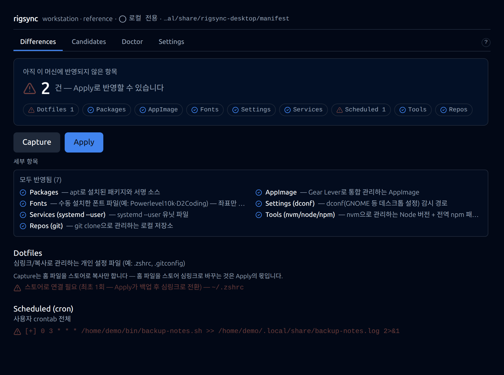

# rigsync-desktop

머신 여러 대를 쓰는 한 사람을 위한, **설정 동기화 데스크탑 앱**. "이 컴퓨터에 뭐가
설치돼 있고 뭐가 다른 컴퓨터랑 다른지"를 3초 안에 보여주고, 다른 컴퓨터를 기준에
맞추는 작업(설치·설정 반영)을 안전하게 대신해준다.

터미널을 몰라도 되는 게 목표다 — Claude Desktop처럼 앱 하나로 끝난다. Electron +
React + TypeScript로 만들어졌고, 현재는 **Linux 전용**(개인 도구, 실제 사용 환경만
지원)이다.



## 왜 만들었나

컴퓨터를 여러 대(연구실 머신·집 컴퓨터 등) 쓰다 보면 "이 셸 설정 저 머신에도
있었나", "그 패키지 여기도 깔았던가" 같은 걸 매번 기억에 의존하게 된다. rigsync는
그 기준을 **git 저장소(manifest)에 선언적으로 박아두고**, 각 머신은 그 기준과
비교해서 "뭐가 아직 안 맞나(diff)"를 보여주고 "맞춰라(apply)"를 실행한다.

## reference / follower — 단방향 배포 모델

머신은 양방향으로 동기화되지 않는다. 정확히 한 대만 **reference**(기준 머신 —
직접 만지고 저장소에 커밋·푸시하는 쪽)이고, 나머지는 전부 **follower**(수신 전용 —
기준을 pull해서 반영만 하는 쪽)다.

이 구분이 가르는 건 이제 세 가지뿐이다: **벌크 Capture**(이 머신 상태를 통째로
스캔해 manifest에 반영), **live-edit 스윕**(라이브 편집을 자동으로 분리 커밋),
**reference의 심링크 배포**(reference 홈 파일이 스토어로의 라이브 뷰가 되는 것).
아래 "창고 모델"의 항목 등록·삭제·구독 전환은 role과 무관하게 어느 머신에서도
할 수 있다 — manifest는 특정 머신의 원판이 아니라 카탈로그이기 때문이다.

## 창고 모델 — 카탈로그와 구독

manifest는 "reference 머신의 스냅샷"이 아니라 **동기화 항목의 카탈로그(창고)**다.
어느 머신이든 항목을 창고에 등록·삭제할 수 있고, 각 머신은 카탈로그 전체가 아니라
**원하는 항목만 구독**한다.

- **등록(register)** — Candidates 화면에서 항목 단위로 창고에 넣는다. 발견형
  capability(apt/flatpak/appimage/fonts/tools/repos)는 이미 이 머신에 있는 항목
  행의 "Register" 버튼 하나로, dotfiles는 "Add file/folder" 다이얼로그로 홈의
  임의 경로를 지정해 등록한다(경로 검증 + 쓰기 전 시크릿 스캔 — 소견이 있으면
  등록을 차단한다, 통과가 아니라 차단이다). 등록한 머신은 그 항목을 자동으로
  구독한다. 삭제(unregister, "Remove from catalog")는 로컬 파일·설치는 절대
  건드리지 않고 카탈로그 등재만 지운다.
- **구독(selection)** — 각 머신은 `hosts/<machineId>/selection.toml`(다른
  머신과 무충돌 — 머신별 파일)에 자신의 구독 상태를 갖는다. 모드는 둘:
  **전체 구독**(`mode = "all"`, 기본값 — 새 카탈로그 항목을 자동으로 받고
  원치 않는 항목만 `exclude`로 뺀다, 연구실 머신 기본)와 **선택 구독**
  (`mode = "select"` — `include`에 명시한 항목만 받는다, 집 머신 등 일부만
  필요한 경우). 온보딩 마지막 스텝에서 고르거나 Settings에서 나중에 바꿀 수
  있다 — 전환해도 기존 include/exclude 목록은 지워지지 않고 죽은 데이터로
  남았다가 되돌리면 되살아난다. 미구독은 제거가 아니다 — 카탈로그엔 그대로
  남고, 이 머신의 diff/apply만 그 항목을 건드리지 않는다.
- **커밋 메시지 = provenance 기록.** git 히스토리는 화면 뒤에 숨어 있지만
  등록·삭제·구독 전환은 전부 `register: <machine> <capability>:<key>` /
  `unregister: …` / `select: <machine> <capability>:<key> (on|off)` /
  `select: <machine> mode=<mode>` 형태의 커밋 메시지를 남긴다 — "누가 언제 이
  항목을 창고에 넣었는가/뺐는가/구독을 바꿨는가"가 커밋 로그 자체로 남는다.
- **함대 전역 제외 → 머신별 구독 해제로 전환.** v4l-utils·ddcutil처럼 "한
  머신 때문에 문제가 생겨 함대 전체에서 ignore했던" 항목이 있다면, 이제는
  카탈로그에서 완전히 빼는 대신 문제 머신만 구독을 끄면 된다: ① Candidates
  화면에서 해당 항목의 ignore(Pause)를 해제해 카탈로그에 다시 포함시키고,
  ② 문제가 있던 머신에서 그 항목의 Subscribe 스위치를 끈다(또는 그 머신이
  `mode = "select"`라면 애초에 include에 넣지 않는다). 다른 머신은 계속
  정상 구독한다.
- **구버전 앱 주의.** `selection.toml`을 모르는 구버전 rigsync-desktop은
  머신별 구독 개념 자체가 없어 카탈로그 전량을 그대로 적용한다 — 구독을
  껐다고 믿고 있어도 구버전 앱이 설치돼 있으면 그 항목이 그대로 반영될 수
  있다. `mode = "select"`로 일부만 받는 구성을 쓰려면 **관련 머신 전체를
  먼저 최신 버전으로 업데이트한 뒤에** 전환하는 게 안전하다.

## 무엇을 동기화하는가 — 9개 capability

| capability | 무엇을 다루나 |
|---|---|
| **packages** | apt(+커스텀 소스/keyring) 패키지 목록 — INV-1: flatpak/snap/AppImage 중복 설치도 감지 |
| **dotfiles** | 심링크/복사로 관리하는 개인 설정 파일 (`.zshrc`, `.gitconfig` 등) |
| **settings** | dconf(GNOME 등 데스크톱 환경 설정) |
| **services** | systemd `--user` 유닛 |
| **scheduled** | 사용자 crontab |
| **tools** | nvm으로 관리하는 Node 버전 + 전역 npm 패키지 |
| **repos** | git clone으로 관리하는 로컬 저장소 |
| **appimage** | [Gear Lever](https://github.com/mijorus/gearlever)로 통합 관리하는 AppImage (T3 — 아래 "3계층 패키지 정책" 참조) |
| **fonts** | 설치된 폰트 패밀리 |

이 위에 **Doctor**(설치 전제조건 체크리스트 — Gear Lever 버전, NVIDIA 드라이버
정합성, manifest 소급 시크릿 스캔, rigsync 자신의 자동 업데이트 소스 설정 여부 등)가
조회 전용으로 얹힌다.

## 3계층 패키지 정책

"이 패키지를 어떻게 설치할까"는 앱을 손대지 않고 결정할 수 있는 문제가 아니라서,
호출 방식별로 3계층으로 분류해 관리한다 (`docs/package-policy.md`에 전문):

- **T1 (apt)** — 배포판 저장소로 설치되는 표준 패키지.
- **T2 (Flatpak)** — 샌드박스 GUI 앱. remote·권한 오버라이드까지 동기화.
- **T3 (AppImage + Gear Lever)** — 단일 바이너리 배포 앱(이 앱 자신도 T3다).
  Gear Lever가 통합·업데이트 추적을 맡고, rigsync는 좌표(어디서 받은 AppImage인지)
  만 선언적으로 동기화한다.

최신성 자체는 이 앱의 목표가 아니다 — 그건 [topgrade](https://github.com/topgrade-rs/topgrade)
같은 도구가 하고, rigsync는 "무엇이 설치돼 있어야 하는가"만 다룬다.

## 안전 불변식 — 왜 이렇게 설계했나

머신을 실제로 바꾸는 도구이므로, "일단 해보고 잘못되면 되돌리자"가 아니라
애초에 잘못될 수 있는 경로를 구조적으로 좁히는 쪽을 택했다.

- **dry-run이 기본값이다.** diff·plan은 언제나 조회만 하고, 실제로 시스템을
  바꾸는 것(Apply)은 별도의 명시적 확인을 거쳐야 실행된다.
- **덮어쓰기 전엔 항상 백업한다** (`~/.rigsync-backup/<timestamp>/`). 되돌릴 수
  없는 변경은 만들지 않는다.
- **시크릿 denylist.** capture(머신 상태 → manifest 회수)는 `id_*`, `*.pem`,
  `*token*`, `*secret*`, `.env*`, `credentials*` 같은 이름 패턴을 가진 파일을
  애초에 담지 않는다. Doctor의 secret scan은 한 걸음 더 나가 이 관문을 우회해
  manifest에 이미 들어간 시크릿까지 소급으로 찾아 경고한다.
- **capture는 additive-only.** 항목이 사라지는 건 사용자가 ignore 설정으로
  명시했을 때뿐 — 자동으로 뭔가를 빼지 않는다.
- **삭제는 자동화하지 않는다.** 후보를 보여줄 뿐, 실행은 항상 사람이 한다.
- **권한 상승 전엔 스크립트 전문을 보여준다.** `pkexec`로 실행될 명령을 실행
  직전에 있는 그대로 노출한다 — 뭘 승인하는지 모르고 승인하는 상황을 막는다.

## 설치

### Gear Lever로 (권장 — 자동 업데이트 추적)

1. [Gear Lever](https://github.com/mijorus/gearlever)를 설치한다 (Flathub:
   `it.mijorus.gearlever`).
2. [Releases](../../releases)에서 최신 `rigsync-desktop-*.AppImage`를 내려받는다.
3. Gear Lever로 열어 통합(integrate)한다.

빌드 산출물 자체에 업데이트 소스가 심겨 있어(`.upd_info` ELF 섹션 —
`gh-releases-zsync|g1r4ff3|rigsync-desktop|latest|<파일명>.zsync`), **통합하는
순간 Gear Lever가 자동으로 인식**하고 이후 업데이트를 추적한다 — 별도 설정
불필요.

이 자동 인식 전(구버전에서 넘어왔거나, 위 embed 이전에 통합해 뒀거나)이라
`[UpdatesNotAvailable]`로 남아 있다면: rigsync는 실행할 때마다 자기 자신이
Gear Lever에 통합돼 있고 소스가 없는 상태인지 확인해 **한 번 스스로
등록을 시도한다**(실패해도 반복하지 않는다 — Doctor 탭 "Auto-update (self)"에서
결과를 확인할 수 있다). 그래도 안 됐다면 아래를 그대로 실행한다(AppImage
경로는 실제 설치 위치로 바꾼다):

```bash
flatpak run it.mijorus.gearlever --set-update-source "<AppImage 경로>" \
  --manager GithubUpdater repo=g1r4ff3/rigsync-desktop \
  repo_filename='rigsync-desktop-*.AppImage' allow_prereleases=false
```

### deb 패키지로

[Releases](../../releases)에서 `rigsync-desktop_*_amd64.deb`을 내려받아
`sudo apt install ./rigsync-desktop_*_amd64.deb` (또는 GUI 패키지 관리자로 설치).

## 빌드에서 개발까지

```bash
npm install
npm run dev          # 개발 모드 실행
npm test              # Vitest
npm run typecheck
npm run lint
npm run build:linux   # AppImage + deb 산출 (dist/)
```

## 개발 상태

개인 도구다 — 저 사람이 쓰는 두 대(연구실 reference, 집 follower)를 기준으로
개발되고 검증된다. Linux 전용, 크로스플랫폼(macOS/Windows)은 아직 계획만 있다
(`FORWARD.md` P5). 버그·아이디어는 이슈로 남겨도 되지만 응답 속도는 보장 못한다.

## 참고 문서

- `FORWARD.md` — 설계 계획·phase
- `CLAUDE.md` — 개발 규율·디자인 계약
- `docs/package-policy.md` — 3계층 패키지 정책 전문
